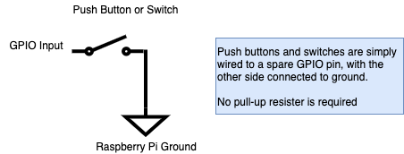
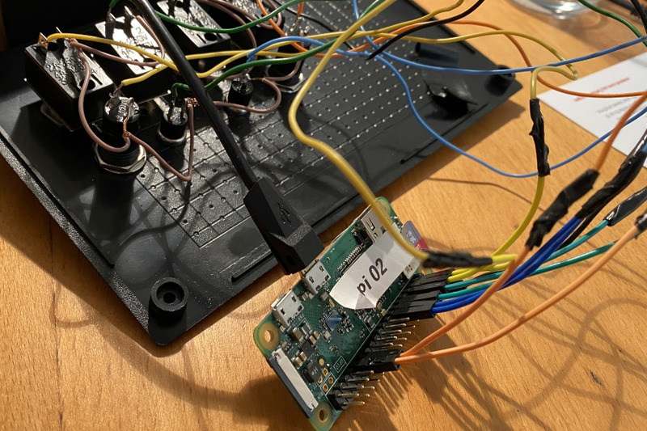
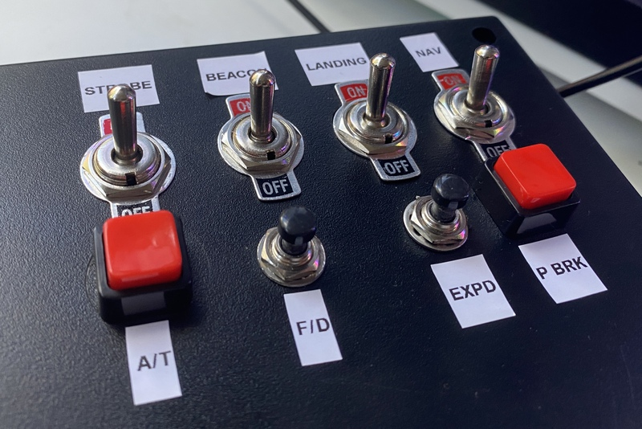
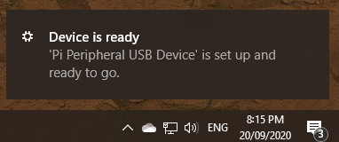
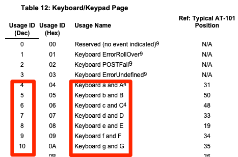
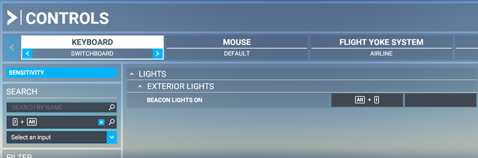

# Pi Peripheral

_Pi Peripheral_ allows physical buttons, switches and dials to control computer actions. 

Why would you want to do this? Well you might want to add some additional buttons or switches to your favorite game. Or maybe you can streamline your video production but switching cameras with a foot pedal. For me, I wanted to add tactile controls to _Microsoft Flight Simulator 2020_.  Switches for the landing gear, beacons and lights. 

In short, _Pi Peripheral_ can be used to control close to any keyboard activated activity - anywhere where physical controls are preferable to using a keyboard.


# Pi Peripheral - Hardware

A Raspberry Pi Zero board acts as a HID (Human Interface Device) device - pretending to be a USB keyboard. Python code generates key-presses when GPIO events are triggered. With basic wiring, the Raspberry Pi has 28 GPIO pins suitable for controlling actions.


## Wiring
The Raspberry Pi is very easy to wire up to switches and push buttons. Each only requires a single connection to a spare GPIO pin, and a common ground. Software will configure the GPIO pin as an input. There is no need to a physical pull up resistor - this can be configured in software.




## Power
Both power and USB host (USB OTG) are provided by a single  micro-USB port. Use the port labeled "USB" (_not_ the one labeled "Power").



## Box Enclosure
You can be creative here - I just picked a generic project box which was easy mount the switches and push buttons.




# Pi Peripheral - Software


## Configure Raspberry Pi Zero as a USB Keyboard
The first software task is configure the Raspberry Pi Zero to act as a USB Keyboard (HID input device.) These steps have largely been inspired from [randomnerdtutorials](https://randomnerdtutorials.com/raspberry-pi-zero-usb-keyboard-hid/) which has more detailed steps should you run into problems.

```
echo "dtoverlay=dwc2" | sudo tee -a /boot/config.txt
echo "dwc2" | sudo tee -a /etc/modules
echo "libcomposite" | sudo tee -a /etc/modules

sudo cp scripts/isticktoit_usb /usr/bin
sudo chmod +x /usr/bin/isticktoit_usb
```

Add this line to the second-last line of `/etc/rc.local` (just before the line containing `exit 0`)

```
/usr/bin/isticktoit_usb # This line new
exit 0 
```
## Installing the Pi Peripheral on your PC
All going well, you can not connect the _Pi Peripheral_ and it should be identified as a keyboard. This will work for Windows, Mac or Linux.  Here's what it looks like in Windows 10.




## Configuring Key Presses
The `piperipheral.py` Python code places events against each GPIO input. An event is fired when either the circuit is completed (button is pressed or the switch is flicked on) or when the circuit is disconnected (button is released or the switch is off).

A keypress is composed of a keyboard code (which represents a key on a keyboard) and a modifier (such as the Shift or control key). To produce a capital *B*, we would need to send the key code of `5` (for the letter _b_) and a modifier value of `00000010` (left Shift).




For the entire mapping look at [usb.org](https://www.usb.org/sites/default/files/documents/hut1_12v2.pdf)

### Keyboard Modifiers

| Bit | Decimal | Modifier key |
|-----|---------|--------------|
| 0   | 1       | left control |
| 1   | 2       | left shift   |
| 2   | 4       | left alt     |
| 3   | 8       | Win/Apple     |
| 4   | 16      | right control    |
| 5   | 32      | right shift     |


### GPIO to key mappings
The GPIO line to key mapping is held in a Python collection

```python
# Key mapping in the form
# GPIO_ID, (press-key,press-key-modifier, release-key,release-key-modifier) 

GPIO_BUTTON_1 = 6
KEY_B = 5

gpio_button_map = dict([
    (GPIO_BUTTON_1, (KEY_B,MOD_ALT, KEY_B,MOD_L_CNTR))  
  ])
```


## Installing the Pi Peripheral Service
Now the Raspberry Pi is acting like a USB Keyboard, we need to send some key commands. The _Pi Peripheral_ is a Python programmed installed as a service

```
sudo cp piperipheral.service /lib/systemd/system

sudo systemctl daemon-reload
sudo systemctl enable piperipheral.service
sudo systemctl start piperipheral.service
```

## Game control binding

This will be specific to your game or program. In _Microsoft Flight Simulator 2020_ you can customize controls with this setup window.




## Miscellaneous 

General checks for determining what's going on with the service.

```
sudo systemctl status piperipheral.service
sudo journalctl -u piperipheral.service -b
ps -ef | grep piperipheral | grep -v grep
```


